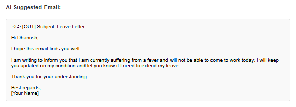
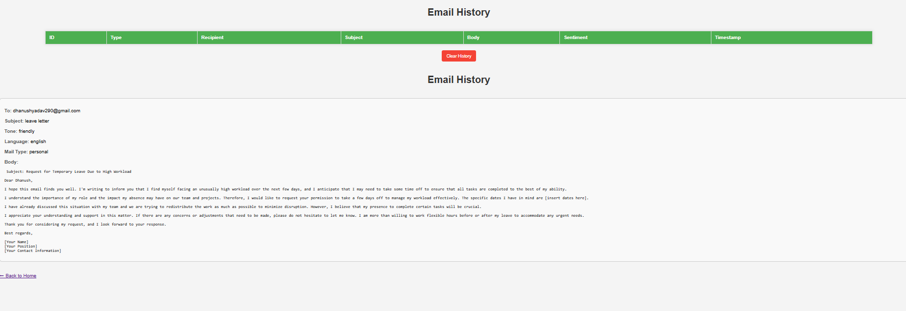

#  AI Email Assistant

An **AI-powered Email Assistant** built using **Flask**, **HTML**, and the **OpenRouter API**.  
It helps users **generate professional emails**, **auto-reply**, and **analyze email tone** — just like Google Gemini or ChatGPT but in your own web app.

---

##  Features

 **AI Email Generation** – Write email content based on subject, tone, and language.  
 **Auto-Reply Assistant** – Reads incoming mail and generates a smart response.  
 **History View** – View previously generated emails.  
 **Multi-Tone Options** – Choose from Friendly, Formal, or Apologetic.  
 **Language Support** – English, Hindi, Telugu (can add more).  
 **Email Sending** – Integrated with Gmail SMTP (secure using App Password).  

---

# Project Screenshots

#  Home Page


#  Output Screen


#  Email History


## Tech Stack

- **Backend:** Flask (Python)
- **Frontend:** HTML, CSS, Bootstrap
- **AI Engine:** OpenRouter API (Mistral model)
- **Database:** JSON (for storing history)
- **Environment Variables:** Python-dotenv  
- **Deployment:** Render (Cloud Hosting)

---

##  Installation & Setup

### 1️ Clone the repository
```bash
git clone https://github.com/yourusername/ai_email_assistant.git
cd ai_email_assistant

